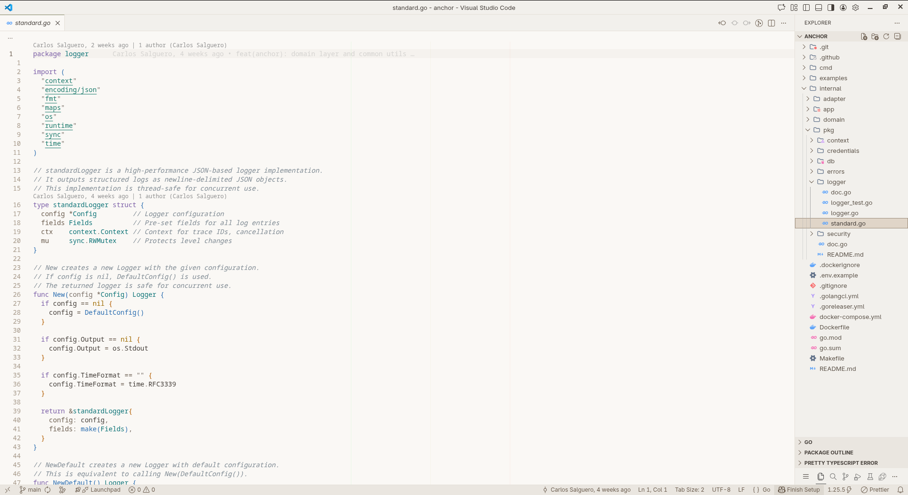
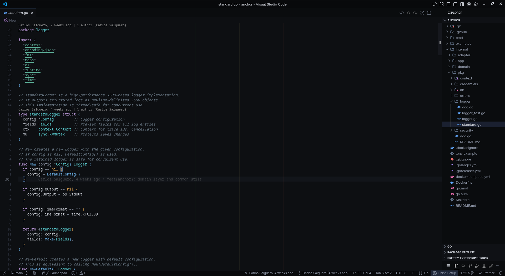

<h1 align="center">
  
  <br>
  Gentle Theme
  <br>
</h1>

<h4 align="center">Accessible, colorblind-safe themes designed for extended coding sessions</h4>

<p align="center">
  <a href="#-why-gentle-theme">Why?</a> •
  <a href="#-screenshots">Screenshots</a> •
  <a href="#-variants">Variants</a> •
  <a href="#-accessibility">Accessibility</a> •
  <a href="#-installation">Install</a>
</p>

<p align="center">
  
  
  
  
</p>

---

## Why Gentle Theme?

Most themes look beautiful but fail at **accessibility**. Gentle Theme is different:

| Problem | Our Solution |
|---------|--------------|
| Red/green confusion for colorblind users | **Teal + Orange** palette (distinguishable by everyone) |
| Pure white backgrounds cause eye strain | **Warm off-whites** reduce glare |
| Pure black backgrounds cause fatigue | **Soft charcoal** backgrounds |
| Oversaturated colors overstimulate | **Balanced saturation** across all tokens |
| Too many bracket colors overwhelm | **4 colors** with high luminance contrast |

Designed for developers who spend **long hours coding**, especially those with:
- Light sensitivity or eye strain
- Color vision deficiency (colorblindness)
- Neurodivergent needs (ADHD, autism, sensory processing)
- Preference for calm, non-distracting interfaces

---

## Screenshots

### Gentle Light
<p align="center">
  
</p>

### Gentle Dark
<p align="center">
  
</p>

### Gentle Midnight
<p align="center">
  
</p>


---

## Variants

### Light Themes
| Theme | Background | Best For |
|-------|------------|----------|
| **Gentle Light** | `#FDFCFA` warm white | Daytime, well-lit rooms |
| **Gentle Light Warm** | `#FAF8F5` cream/sepia | Light sensitivity, blue light reduction |

### Dark Themes
| Theme | Background | Best For |
|-------|------------|----------|
| **Gentle Dark** | `#1C1E22` soft charcoal | Evening coding, standard dark |
| **Gentle Dark Warm** | `#1F1D1A` warm charcoal | Cozy aesthetic, reduced blue light |

### Midnight Themes (OLED-optimized)
| Theme | Background | Best For |
|-------|------------|----------|
| **Gentle Midnight** | `#0D0F12` near-black cool | OLED screens, very dark rooms |
| **Gentle Midnight Warm** | `#100E0C` near-black warm | OLED screens, warm aesthetic |

---

## Accessibility

### Colorblind-Safe Palette

Based on **Wong's colorblind-safe palette** and **IBM accessibility research**:

```
Color Family Mapping:
━━━━━━━━━━━━━━━━━━━━━━━━━━━━━━━━━━━━━━━━━━━━━━━━
STRUCTURAL    Purple     → Keywords, control flow
DATA          Teal-Green → Strings (NOT pure green)
              Amber      → Numbers, constants
CALLABLE      Blue       → Functions, methods
TYPES         Teal       → Classes, interfaces
MARKUP        Terracotta → HTML tags (NOT pure red)
NEUTRAL       Gray       → Variables, operators
━━━━━━━━━━━━━━━━━━━━━━━━━━━━━━━━━━━━━━━━━━━━━━━━
```

**Why this works:**
- **Protanopia/Deuteranopia (red-green):** Teal vs Terracotta distinguishable by luminance
- **Tritanopia (blue-yellow):** Blue vs Purple have different saturation levels
- **All types:** Colors differ in both hue AND luminance

### Git Status Colors

Traditional red/green is replaced with colorblind-safe alternatives:

| Status | Color | Hex |
|--------|-------|-----|
| Modified | Blue | `#2A6DB0` / `#6AAFE6` |
| Added | Teal | `#0D7377` / `#56C4C8` |
| Deleted | Orange | `#C65D3D` / `#E8835A` |

### Reduced Cognitive Load

- **4 bracket colors** (not 6) - easier to track nesting
- **Consistent semantics** - same colors mean same things across all 6 themes
- **Balanced saturation** - no "loud" colors competing for attention

### WCAG Compliance

All text meets **WCAG AA** (4.5:1 minimum contrast):
- Optimized for extended reading (not maximum contrast which causes fatigue)
- Comments visible but not competing with code

---

## Installation

### VS Code Marketplace
1. Open Extensions (`Ctrl+Shift+X` / `Cmd+Shift+X`)
2. Search **"Gentle Theme"**
3. Click **Install**
4. `Ctrl+K Ctrl+T` / `Cmd+K Cmd+T` → Select variant

### Manual
```bash
cd ~/.vscode/extensions
git clone https://github.com/your-username/gentle-theme.git
# Restart VS Code
```

---

## Color Palette Reference

### Syntax Colors (Light / Dark)

| Element | Light | Dark | Role |
|---------|-------|------|------|
| Keywords | `#7B5EA7` | `#B794D4` | Control flow, storage |
| Strings | `#1A7A6C` | `#5FB49C` | Text literals |
| Numbers | `#B35D00` | `#E8A854` | Numeric values |
| Functions | `#2A6DB0` | `#6AAFE6` | Callable code |
| Types | `#0D7377` | `#56C4C8` | Type definitions |
| HTML Tags | `#C65D3D` | `#E8835A` | Markup elements |
| Comments | `#7F8A93` | `#6B7A87` | Documentation |
| Variables | `#3D424A` | `#D8DCE2` | Identifiers |

### Bracket Colors

Only 4 colors for reduced cognitive load:

| Level | Light | Dark |
|-------|-------|------|
| 1 | `#2A6DB0` Blue | `#6AAFE6` |
| 2 | `#9E6B00` Amber | `#E8A854` |
| 3 | `#7B5EA7` Purple | `#B794D4` |
| 4 | `#0D7377` Teal | `#56C4C8` |

---

## Recommended Settings

```json
{
  "editor.fontFamily": "'JetBrains Mono', 'Fira Code', monospace",
  "editor.fontSize": 14,
  "editor.lineHeight": 1.6,
  "editor.bracketPairColorization.enabled": true,
  "editor.guides.bracketPairs": true,
  "editor.cursorBlinking": "solid",
  "editor.smoothScrolling": true
}
```

### For Light Sensitivity

1. Use **Warm** variants
2. Reduce monitor brightness to 40-60%
3. Enable OS blue light filter

---

## Customization

```json
{
  "workbench.colorCustomizations": {
    "[Gentle Dark]": {
      "editor.background": "#1A1C20"
    }
  },
  "editor.tokenColorCustomizations": {
    "[Gentle Dark]": {
      "comments": "#707888"
    }
  }
}
```

---

## Contributing

When contributing:
- All colors must pass WCAG AA contrast
- Test with colorblind simulators (Coblis, Color Oracle)
- Avoid pure black/white
- Consider neurodivergent users

---

## License

MIT

---

<p align="center">
  <strong>Made with care for developers who need a gentler coding experience.</strong>
  <br>
  <sub>Colorblind-safe • Eye-friendly • Neurodivergent-inclusive</sub>
</p>
